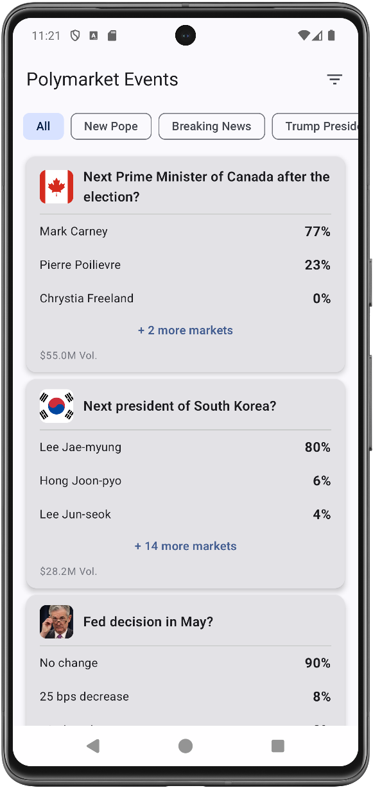
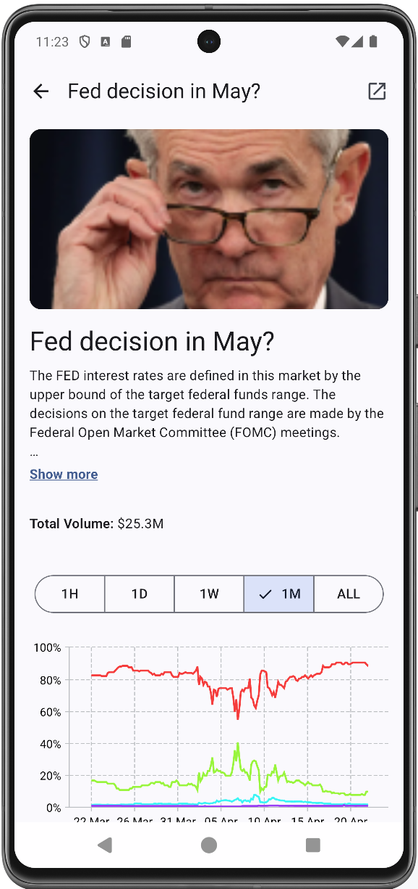
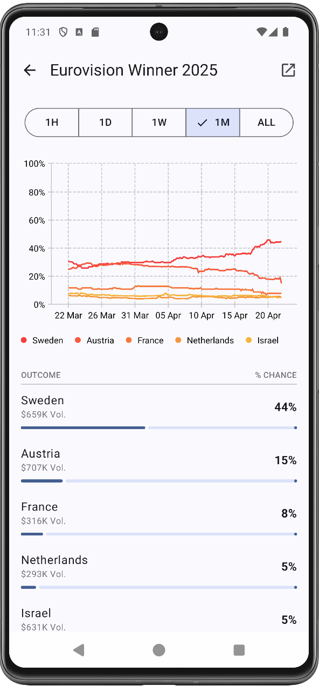
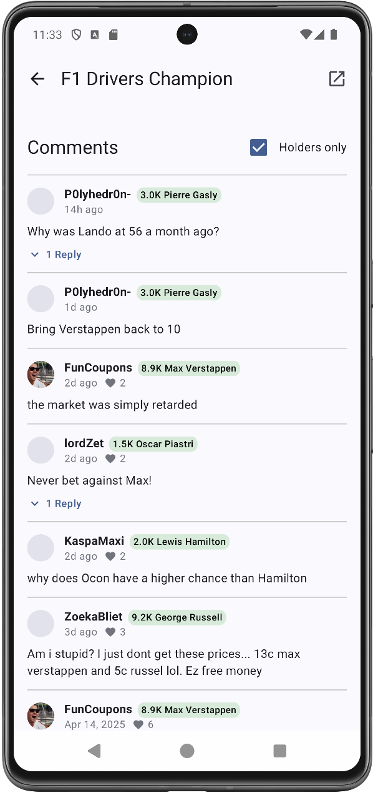
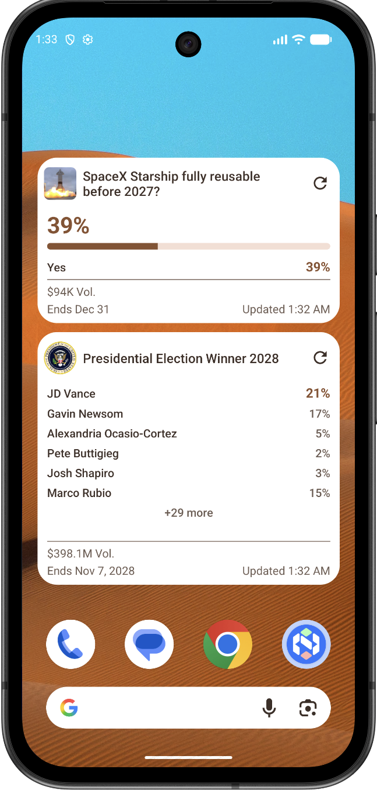

# Polymarket Viewer

Android app for convenient Polymarket market browsing, including home screen widget support. 
Built with Jetpack Compose and modern Android practices following Clean Architecture.

## Screenshots

  
  
  
  
  

## Features

### Discover

*   📊 Browse active prediction market events
*   🔍 Search, filter, and sort with key metrics
*   ⭐ Save favorite events to your watchlist

### Analyze

*   📋 View event details, outcomes, markets, and volume
*   📈 Explore interactive market price history charts
*   💬 Read threaded comments and open user profiles

### Widget

*   🧩 Add selected events as home screen widgets
*   🔄 Open from widget and refresh manually or periodically

## Download

### F-Droid (Recommended)

### GitHub Releases
Download the latest APK from [Releases](https://github.com/streamatico/PolymarketViewer/releases/latest).

*Enable "Install from unknown sources" in Android settings before installing.*

## Architecture

This project follows **Clean Architecture** principles with clear separation of concerns:

*   **Presentation Layer** (`ui/`) - Jetpack Compose screens, ViewModels, and UI state models
*   **Domain Layer** (`domain/`) - Repository contracts and domain-facing models (e.g., `PolymarketRepository`)
*   **Data Layer** (`data/`) - API clients, repository implementations, preferences, and DTOs
*   **Dependency Injection** (`di/`) - Koin modules for dependency management

## Technologies

*   **Language**: [Kotlin](https://kotlinlang.org/)
*   **UI**: [Jetpack Compose](https://developer.android.com/jetpack/compose) with [Material 3](https://m3.material.io/)
*   **Navigation**: [Navigation 3](https://developer.android.com/develop/ui/compose/navigation/navigation3)
*   **Networking**: [Ktor Client](https://ktor.io/)
*   **Widgets**: [AndroidX Glance App Widgets](https://developer.android.com/develop/ui/compose/glance)
*   **Background Work**: [WorkManager](https://developer.android.com/topic/libraries/architecture/workmanager)
*   **Local Storage**: [DataStore Preferences](https://developer.android.com/topic/libraries/architecture/datastore)
*   **Charts**: [Vico Charts](https://github.com/patrykandpatrick/vico)
*   **DI**: [Koin](https://insert-koin.io/)
*   **Images**: [Coil](https://coil-kt.github.io/coil/)

## Acknowledgments

Special thanks to the maintainers and contributors of the open source libraries that make this project possible:

*   [Vico Charts](https://github.com/patrykandpatrick/vico) by @patrykandpatrick - Beautiful charts for Compose
*   [Coil](https://github.com/coil-kt/coil) - Efficient image loading for Android
*   [Ktor](https://github.com/ktorio/ktor) - Kotlin multiplatform HTTP client
*   [Koin](https://github.com/InsertKoinIO/koin) - Pragmatic lightweight dependency injection for Kotlin
*   [Kotlin](https://github.com/JetBrains/kotlin) - The amazing language powering this app

## Requirements

*   **Android**: 8.1+ (API level 27)
*   **Target SDK**: 36 (Android 16)
*   **Build JDK**: 21 (Temurin/Adoptium)

Gradle daemon JVM is pinned in `gradle/gradle-daemon-jvm.properties` and should stay aligned with CI.

## Disclaimer

This is an unofficial, experimental application and is not affiliated with Polymarket. Data is sourced from Polymarket.com via their public API. Use at your own discretion.

## Contact

If you have any questions or suggestions, please contact us at: <streamatico+polymarket@gmail.com>.

Visit our website: [streamatico.com](https://streamatico.com/)
