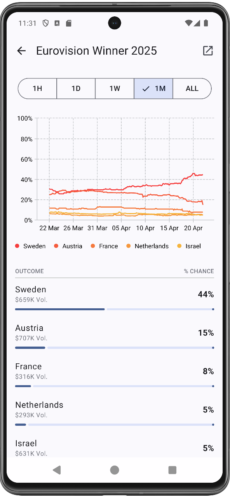

# Polymarket Viewer

Android client application for browsing Polymarket prediction markets. Built with Jetpack Compose and modern Android development practices following Clean Architecture principles.

## Screenshots

  
  
  
  

## Features

*   📊 Browse a list of active prediction market events from Polymarket.com
*   🔍 Filter by category and search events by keywords  
*   📈 Sort events by various criteria (Volume 24h/All Time, Liquidity, Newest, Ending Soon, Competitive)
*   📋 View detailed event information with description, markets, and volume data
*   📊 Display interactive price history charts for events
*   🎨 Adaptive card layouts for different market types (binary, categorical, multi-market)
*   💬 Comments system with hierarchical structure and holder filtering
*   📄 Pagination for loading more events and comments
*   🎨 Material 3 design with dynamic theming

## Download

### F-Droid (Recommended)

### GitHub Releases
Download the latest APK from [Releases](https://github.com/streamatico/PolymarketViewer/releases/latest).

*Enable "Install from unknown sources" in Android settings before installing.*

## Architecture

This project follows **Clean Architecture** principles with clear separation of concerns:

*   **Presentation Layer** (`ui/`) - Jetpack Compose UI with ViewModels and UI states
*   **Domain Layer** (`domain/`) - Use cases and business logic interfaces
*   **Data Layer** (`data/`) - Repositories, data sources, and DTOs
*   **Dependency Injection** (`di/`) - Hilt modules for dependency management

## Technologies

*   **Language**: [Kotlin](https://kotlinlang.org/)
*   **UI**: [Jetpack Compose](https://developer.android.com/jetpack/compose) with [Material 3](https://m3.material.io/)
*   **Architecture**: Clean Architecture with MVVM
*   **Navigation**: [Navigation 3](https://developer.android.com/develop/ui/compose/navigation/navigation3)
*   **Networking**: [Ktor Client](https://ktor.io/) 
*   **Charts**: [Vico Charts](https://github.com/patrykandpatrick/vico)
*   **DI**: [Hilt](https://dagger.dev/hilt/)
*   **Images**: [Coil](https://coil-kt.github.io/coil/)

## Acknowledgments

Special thanks to the maintainers and contributors of the open source libraries that make this project possible:

*   [Vico Charts](https://github.com/patrykandpatrick/vico) by @patrykandpatrick - Beautiful charts for Compose
*   [Coil](https://github.com/coil-kt/coil) - Efficient image loading for Android
*   [Ktor](https://github.com/ktorio/ktor) - Kotlin multiplatform HTTP client
*   [Kotlin](https://github.com/JetBrains/kotlin) - The amazing language powering this app

## Requirements

*   **Android**: 8.1+ (API level 27)
*   **Target SDK**: 36 (Android 16)

## Disclaimer

This is an unofficial, experimental application and is not affiliated with Polymarket. Data is sourced from Polymarket.com via their public API. Use at your own discretion.

## Contact

If you have any questions or suggestions, please contact us at: <streamatico+polymarket@gmail.com>.

Visit our website: [streamatico.net](https://streamatico.net/)
